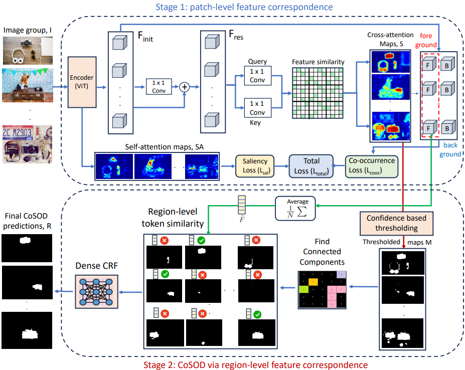
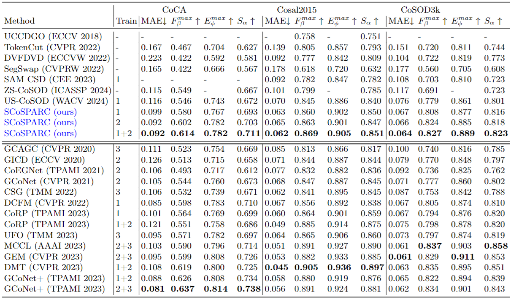

# SCoSPARC
This repository contains codes and results for the paper:

Self-supervised co-salient object detection via feature correspondence at multiple scales

Souradeep Chakraborty, Dimitris Samaras

Stony Brook University

ECCV 2024 ([Paper](https://www.ecva.net/papers/eccv_2024/papers_ECCV/papers/01402.pdf))

## Abstract

Our paper introduces a novel two-stage self-supervised approach for detecting co-occurring salient objects (CoSOD) in image groups without requiring segmentation annotations. Unlike existing unsupervised methods that rely solely on patch-level information (e.g. clustering patch descriptors) or on computation heavy off-the-shelf components for CoSOD, our lightweight model leverages feature correspondences at both patch and region levels, significantly improving prediction performance. In the first stage, we train a self-supervised network that detects co-salient regions by computing local patch-level feature correspondences across images. We obtain the segmentation predictions using confidence-based adaptive thresholding. In the next stage, we refine these intermediate segmentations by eliminating the detected regions (within each image) whose averaged feature representations are dissimilar to the foreground feature representation averaged across all the cross-attention maps (from the previous stage). Extensive experiments on three CoSOD benchmark datasets show that our self-supervised model outperforms the corresponding state-of-the-art models by a huge margin (e.g. on the CoCA dataset, our model has a 13.7% F-measure gain over the SOTA unsupervised CoSOD model). Notably, our self-supervised model also outperforms several recent fully supervised CoSOD models on the three test datasets (e.g., on the CoCA dataset, our model has a 4.6% F-measure gain over a recent supervised CoSOD model). 

## Framework Overview



## Result

+ Comparison with the existing state-of-the-art methods on the three test sets (CoCA, Cosal2015 and CoSOD3K datasets):


"Train" indicates the training dataset: "1": COCO9213, "2": DUTS-Class, "3": COCOSEG, "-": no training.

## Download

​	Find **predicted saliency maps** and all other stuff on my [google-drive folder for this work]():

## Training and inference codes
  *** To be updated soon ***
  
### Citation

```
@article{chakraborty2024self,
  title={Self-supervised co-salient object detection via feature correspondence at multiple scales},
  author={Chakraborty, Souradeep and Samaras, Dimitris},
  journal={arXiv preprint arXiv:2403.11107},
  year={2024}
}


