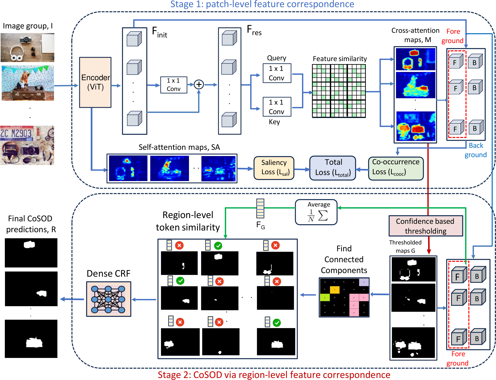

# SCoSPARC
This repository contains codes and results for the paper:

> [**Self-supervised co-salient object detection via
feature correspondences at multiple scales**](https://www.ecva.net/papers/eccv_2024/papers_ECCV/papers/01402.pdf)  
> Souradeep Chakraborty, Dimitris Samaras,  
>  
> *ECCV 2024 ([ECCV](https://www.ecva.net/papers/eccv_2024/papers_ECCV/papers/01402.pdf))*


## Abstract

Our paper introduces a novel two-stage self-supervised approach for detecting co-occurring salient objects (CoSOD) in image groups without requiring segmentation annotations. Unlike existing unsupervised methods that rely solely on patch-level information (e.g. clustering patch descriptors) or on computation heavy off-the-shelf components for CoSOD, our lightweight model leverages feature correspondences at both patch and region levels, significantly improving prediction performance. In the first stage, we train a self-supervised network that detects co-salient regions by computing local patch-level feature correspondences across images. We obtain the segmentation predictions using confidence-based adaptive thresholding. In the next stage, we refine these intermediate segmentations by eliminating the detected regions (within each image) whose averaged feature representations are dissimilar to the foreground feature representation averaged across all the cross-attention maps (from the previous stage). Extensive experiments on three CoSOD benchmark datasets show that our self-supervised model outperforms the corresponding state-of-the-art models by a huge margin (e.g. on the CoCA dataset, our model has a 13.7% F-measure gain over the SOTA unsupervised CoSOD model). Notably, our self-supervised model also outperforms several recent fully supervised CoSOD models on the three test datasets (e.g., on the CoCA dataset, our model has a 4.6% F-measure gain over a recent supervised CoSOD model). 

## Model Overview



## Result

+ Comparison with the existing state-of-the-art methods on the three test sets (CoCA, Cosal2015 and CoSOD3K datasets):


"Train" indicates the training dataset: "1": COCO9213, "2": DUTS-Class, "3": COCOSEG, "-": no training.

The top block compares different unsupervised CoSOD models. The lower block compares the performance of recent supervised CoSOD models. Our self-supervised SCoSPARC achieves state-of-the-art performance for unsupervised CoSOD (upper block) and outperforms recent supervised CoSOD methods (e.g. DCFM, CoRP, UFO) while being comparable to the SOTA (lower block).

## Download

​**Predicted saliency maps** will be available for download shortly on my [google-drive folder]().

## Datasets

​The testing datasets - CoCA, Cosal2015, and CoSOD3k are available on my [Google drive](https://drive.google.com/drive/folders/10NfCoB4dIweSGE887cN2vZ4I2CoV7uXQ?usp=sharing). Unzip the zip files and put the dataset folders inside the "dataset" directory.

The training datasets could be downloaded from: [COCO-9213](https://drive.google.com/file/d/1r6tRcSlvH8bXhaZD2VtGmHDxsXFl1v4z/view?usp=drive_link), [DUTS Class](https://drive.google.com/file/d/1SKaxMtIaLJk2CRdSbf-S0m6vMag1grmd/view?usp=drive_link).

Please move all datasets to the 'datasets' directory and update the paths accordingly in both the training and testing scripts.

## Training
  Please run 'train.py' to train the stage 1 sub-network of our model. The model checkpoints will be saved in the "checkpoints" directory.

## Inference
  Please run 'test.py' to generate CoSOD predictions on the test datasets. The model predictions will be saved in the "predictions" directory.
  
  The model_DUTS_Cls_only.pt is the checkpoint for the Stage 1 sub-network, which was trained on the DUTS Class dataset (dataset number "2") as referenced in Table 2 of the main paper. Checkpoints for models trained on other datasets will be made available soon. You can also train and save the model checkpoints on training datasets you wish.

  Please download the DINO pretrained model from my [Google drive](https://drive.google.com/file/d/1VcBGsYutglgIpgLnjrlUA99r6MA7En5c/view?usp=sharing) and place this model file in the "models" directory.

## Contact
Please contact me here for any queries: souchakrabor@cs.stonybrook.edu
  
### Citation

```
@article{chakraborty2024self,
  title={Self-supervised co-salient object detection via feature correspondences at multiple scales},
  author={Chakraborty, Souradeep and Samaras, Dimitris},
  journal={arXiv preprint arXiv:2403.11107},
  year={2024}
}


